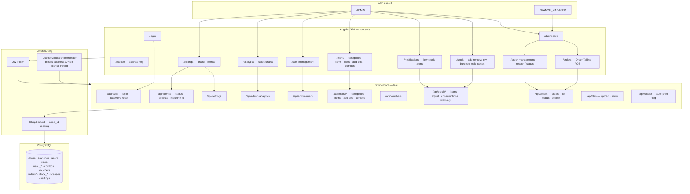

# Fast Food Order Taking System

A modern, fast, minimal **shop order / staff POS** platform (Spring Boot API + Angular desktop SPA) with centralized PostgreSQL, JWT auth, stock, analytics, and license gating.

> Multi-shop ready via `shop_id`. Customer website / mobile apps are **out of scope** for this repo.

## Architecture overview

| Layer | Tech |
|--------|------|
| **Frontend** | Angular SPA (`frontend/`) — staff POS + admin |
| **Backend** | Java 21 / Spring Boot 3 — `domain` · `application` · `infrastructure` · `presentation` |
| **Database** | PostgreSQL + **Flyway** (`src/main/resources/db/migration/`) |
| **Security** | JWT + roles (`ADMIN`, `BRANCH_MANAGER`) + license interceptor |

### Module & functionality map



### Access matrix (UI + API)

| Area | ADMIN | BRANCH_MANAGER | Needs valid license? |
|------|:-----:|:--------------:|:--------------------:|
| Order Taking / Order Management | ✅ | ✅ | ✅ Yes |
| Stock Management + stock notifications | ✅ | ❌ | ✅ Yes |
| Menu / Users / Analytics / Vouchers | ✅ | ❌ | ✅ Yes |
| Settings (brand + renew license) | ✅ | ❌ | ❌ Always (so admin can renew) |
| Login / License status APIs | ✅ | ✅ | ❌ |

**Backend enforcement:** role via `@PreAuthorize` / `SecurityConfig`; license via `LicenseValidationInterceptor` (403 `LICENSE_INVALID` when expired). Exempt: `/api/license/**`, `/api/auth/**`, `/api/settings/**`, `/api/files/**`, health, receipt.

### Backend package layout

```
com.fastfood.order/
├── domain/entity          # Order, Menu*, Stock*, User, License, Shop, …
├── application/service    # Business logic (OrderService, StockManagementService, …)
├── application/dto        # Request/response DTOs
├── infrastructure/        # JPA repos, JWT, license interceptor, API JSON logging, storage
└── presentation/controller# REST endpoints under /api/*
```

### Frontend feature screens

```
frontend/src/app/
├── components/            # login, dashboard, order-taking, stock-management, …
├── services/              # HTTP clients (order, stock, license, …)
├── guards/                # AuthGuard, AdminGuard
└── app.routes.ts          # Route → screen mapping
```

## Features

### Core POS
- Fast order taking (table pickup, takeaway, home delivery)
- Menu with categories, sizes, add-ons, combos, vouchers
- Cash on spot / cash on delivery
- Auto stock deduction from **Consumption Config** (yield per menu item)
- Receipt auto-print support

### Stock (Admin)
- Stock names, unit, threshold, barcode, qty-per-scan
- Add stock (additive) / remove expired·damaged
- Barcode scanner restock
- Low-stock warnings + notification bell

### Admin
- Sales analytics (charts, filters)
- User management (ADMIN / BRANCH_MANAGER)
- Brand settings + license activation
- EN / UR (RTL) i18n

## Project Structure

```
fast-food-order-api/
├── src/main/java/com/fastfood/order/   # Backend (see package layout above)
├── src/main/resources/
│   ├── application*.yml
│   └── db/migration/                   # Flyway V1+
├── database/                           # Manual/bootstrap SQL helpers
├── frontend/                           # Angular SPA
├── pom.xml
└── README.md
```

## Setup Instructions

### Prerequisites
- Java 21 (LTS)
- Maven 3.8+
- PostgreSQL 14+
- Node.js 18+ and npm
- Angular CLI 17+

### Backend Setup

1. **Database Setup**
   ```sql
   CREATE DATABASE fastfood_order_db;
   CREATE USER fastfood_user WITH PASSWORD 'fastfood_password';
   GRANT ALL PRIVILEGES ON DATABASE fastfood_order_db TO fastfood_user;
   ```

2. **Create Database Schema**
   - Run the SQL script located at `database/schema.sql` to create all tables and initial data
   ```bash
   psql -U fastfood_user -d fastfood_order_db -f database/schema.sql
   ```

3. **Configure Application**
   - Copy `.env.example` to `.env` (or set environment variables)
   - Update environment variables with your database credentials:
     ```bash
     DATABASE_URL=jdbc:postgresql://localhost:5432/fast-food
     DATABASE_USERNAME=your_username
     DATABASE_PASSWORD=your_password
     JWT_SECRET_KEY=your-strong-secret-key
     API_KEY=your-api-key
     ```
   - For development, you can also use `application-dev.yml` profile
   - For production, use `application-prod.yml` profile (requires environment variables)

4. **Run Application**
   ```bash
   mvn clean install
   mvn spring-boot:run
   ```

4. **Default Admin Credentials**
   - Username: `admin`
   - Password: `Admin@123`
  
     if it gives any error like invalid user/pass then make this request from postman and can see the logs of java app you can see the hash prints there and you can update that hash in users table for admin user

     curl --location 'http://localhost:8080/fast-food-order-api' \
--header 'Content-Type: application/json' \
--data-raw '{
  "password": "Admin@123",
  "hash": "$2a$10$N9qo8uLOickgx2ZMRZoMyeIjZAgcfl7p92ldGxad68LJZdL17lhWy"
}'
     

### Frontend Setup

1. **Install Dependencies**
   ```bash
   cd frontend
   npm install
   ```

2. **Run Development Server**
   ```bash
   ng serve
   ```

3. **Build for Production**
   ```bash
   ng build --configuration production
   ```

4. **Build Electron Desktop App**
   ```bash
   npm run electron:build
   ```

## API Endpoints

### Authentication
- `POST /api/auth/login` - User login

### Orders
- `POST /api/orders` - Create new order
- `GET /api/orders` - List orders
- `GET /api/orders/{id}` - Get order details

### Analytics (Admin Only)
- `GET /api/admin/analytics/sales` - Sales analytics

### Menu Management
- `GET /api/menu/categories` - List categories
- `GET /api/menu/items` - List menu items
- `POST /api/menu/items` - Create menu item

## Database Schema

Schema evolves with **Flyway** under `src/main/resources/db/migration/`.  
`database/schema.sql` and related scripts are helpers / bootstrap references.

Key areas:
- **shops / branches / users / roles** — tenancy and access (`ADMIN`, `BRANCH_MANAGER`)
- **menu_*** / **combos** / **vouchers** — catalog
- **orders*** — POS orders
- **stock_items** / **stock_transactions** / **stock_item_consumptions** / **stock_warnings** — inventory
- **licenses** / **settings** — activation and brand
- **franchise_inquiries** — franchise form submissions

## Security

- All API endpoints require JWT authentication (except `/api/auth/**` and `/api/public/**`)
- Role-based access control:
  - `/api/admin/**` - Admin only
  - `/api/branch-manager/**` - Admin and Branch Manager

## Development

### Running Tests
```bash
mvn test
```

### Code Style
- Follow SOLID principles
- Use Clean Architecture layers
- Follow Java naming conventions
- Use Lombok for boilerplate reduction

## Future Enhancements

- Multi-branch support (database ready)
- Online payment gateway integration
- Rider tracking system
- Mobile app integration
- Advanced franchise management

## License

Proprietary - All rights reserved

